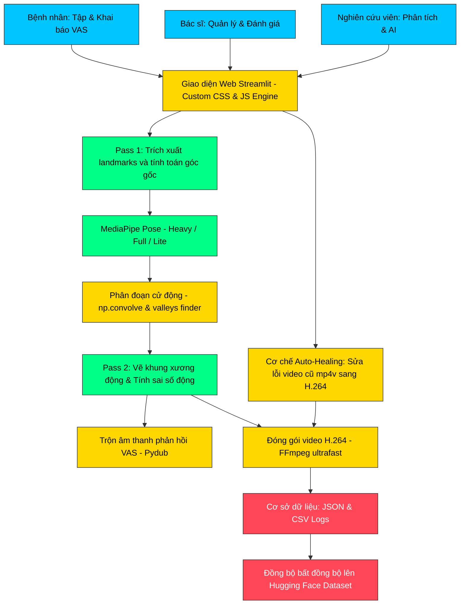

# 🏥 Rehab AI Monitor (Clinical Ecosystem)

**Hệ thống giám sát tập luyện Phục hồi chức năng từ xa dựa trên Trí tuệ nhân tạo (AI) và Thị giác máy tính - Giải pháp Clinical-Grade chuyên nghiệp.**

[](https://quynhphuong1209-rehab-ai-monitor-2026.hf.space/)
[](https://opensource.org/licenses/MIT)

## 📚 Giới thiệu đề tài
Đây là sản phẩm thuộc **Đề tài Nghiên cứu Khoa học cấp Trường (2025-2026)** tại trường **Đại học Y tế Công cộng**, phối hợp cùng **Bệnh viện Đa khoa Phạm Ngọc Thạch**. 

Hệ thống giúp tự động hóa việc giám sát và đánh giá các bài tập phục hồi chức năng (PHCN) cho bệnh nhân viêm quanh khớp vai, đảm bảo bệnh nhân tập luyện đúng kỹ thuật ngay cả khi ở nhà thông qua phân tích AI thời gian thực.

## ✨ Tính năng nổi bật (v3.1 Updated)
- 💎 **Thẩm mỹ Lâm sàng:** Giao diện sử dụng font chữ 'Times New Roman' chuẩn mực, thiết kế card-based hiện đại với hiệu ứng Glassmorphism.
- 🌓 **Đồng bộ Theme:** Hỗ trợ hoàn hảo chế độ Sáng (Light) và Tối (Dark) với sự chuyển đổi mượt mà, không lỗi tương phản.
- 📱 **Mobile-First Optimization:** Hệ thống Tab được tối ưu hóa toàn diện cho di động, đảm bảo chữ không bị tràn, hiển thị đầy đủ và hỗ trợ cuộn ngang chuyên nghiệp.
- 🩺 **Luồng liên lạc khép kín:** Bệnh nhân khai báo triệu chứng (VAS) -> Chuyên gia nhận xét lâm sàng -> Kết nối kết quả AI.
- 🚀 **Điều hướng Auto-Tab:** Tự động chuyển Tab thông minh khi chọn video để đánh giá, tối ưu hóa thao tác người dùng.
- 🦾 **Phân tích khung xương AI:** Tích hợp MediaPipe Pose Estimation (Heavy/Full/Lite) với độ chính xác cao.
- 📱 **Sidebar Phẳng (Flattened):** Cấu trúc Sidebar mật độ cao, truy cập nhanh thông tin bệnh nhân và khai báo triệu chứng.

## 🗺️ Cấu trúc Tab Điều hướng (Role-based)
Hệ thống tự động thay đổi cấu trúc dựa trên vai trò người dùng:
- **Bệnh nhân:** Tập luyện, xem nhận xét từ Bác sĩ & AI, xem lịch sử tiến triển, khai báo VAS và theo dõi lịch nhắc nhở.
- **Bác sĩ / KTV:** Quản lý BN, thực hiện đánh giá lâm sàng (Ground Truth), đối chiếu kết quả AI để đưa ra phác đồ điều trị.
- **Nghiên cứu viên:** Phân tích sâu dữ liệu kỹ thuật, xem kết quả lâm sàng của Bác sĩ để hiệu chỉnh mô hình AI, quản lý Dataset.
- **Quản trị viên:** Quản lý tài khoản, bảo trì hệ thống, dọn dẹp cơ sở dữ liệu và theo dõi Nhật ký hoạt động toàn hệ thống (Log).

## 🏗️ Kiến trúc hệ thống (Architecture Overview)

Hệ thống được thiết kế theo mô hình kiến trúc phân lớp tối ưu hiệu năng chạy trên các nền tảng đám mây CPU-only (như Hugging Face Spaces). Dưới đây là sơ đồ và luồng hoạt động chi tiết:

### Sơ đồ luồng hoạt động (Data & Control Flow)



### Các thành phần chính trong kiến trúc:

1. **Luồng xử lý Video 2-Pass tối ưu bộ nhớ:**
   * **Pass 1 (Trích xuất dữ liệu thô):** Đọc từng khung hình video từ `cv2.VideoCapture`, chuẩn hóa kích thước (resize) và xoay chiều phù hợp. MediaPipe Pose chạy trên ảnh RGB để lấy 33 điểm landmarks, sau đó tính toán góc vai và góc khuỷu mà không vẽ hoặc ghi file nhằm tiết kiệm RAM tối đa.
   * **Phân đoạn Giai đoạn tự động (Segmentation):** Áp dụng bộ lọc mượt tích chập (`np.convolve`) lên chuỗi tín hiệu góc khớp để khử nhiễu. Thuật toán tìm điểm cực tiểu (valleys) để chia video bệnh nhân thành 3 giai đoạn cử động (Giai đoạn 1 bắt đầu giơ tay, Giai đoạn 2 dạng sai số vừa, Giai đoạn 3 chuẩn xác dần).
   * **Pass 2 (Vẽ đè & Gộp đa phương tiện):** Sử dụng landmarks đã trích xuất ở Pass 1 để vẽ khung xương động, vòng cung góc khớp trực tiếp lên frame. Sai số động được áp dụng theo phân đoạn (GĐ1: 45°, GĐ2: 30°, GĐ3: 15°).
   
2. **Hệ thống phản hồi âm thanh & Đóng gói Video:**
   * **Voice Feedback Engine:** Trích xuất các khoảnh khắc chuyển đổi trạng thái (Đúng, Gần đúng, Sai). Sử dụng `pydub` để nối ghép các file âm thanh chỉ dẫn. Hệ thống tự động giới hạn tối đa 40 sự kiện âm thanh để tránh tràn RAM (Out of Memory - OOM).
   * **FFmpeg H.264 Transcoding:** Sử dụng bộ mã hóa `libx264` cùng với cấu hình `-preset ultrafast` và `-crf 24` để nén video thô `mp4v` thành định dạng H.264 chuẩn web, đảm bảo video hiển thị mượt mà trên mọi thiết bị di động mà không bị lag/buffering.

3. **Cơ chế Tự sửa lỗi thông minh (Auto-Healing Engine):**
   * Tích hợp trực tiếp vào hàm `render_video`. Khi phát hiện người dùng tải lại kết quả của các phiên tập cũ có video định dạng `mp4v` không chơi được, hệ thống sẽ tự động kích hoạt `ffmpeg` ngầm để chuyển đổi sang H.264 chuẩn, đồng thời tự động cập nhật lại cơ sở dữ liệu `video_list.json` mà không làm gián đoạn trải nghiệm của người dùng.

4. **Đồng bộ hóa dữ liệu đám mây bất đồng bộ (Async Cloud Sync):**
   * Sử dụng luồng chạy nền (`threading.Thread` độc lập) để tải dữ liệu CSV tọa độ và các file video thành phẩm lên Hugging Face Dataset. Cơ chế này giúp giữ cho luồng giao diện (UI) chính của Streamlit luôn mượt mà, không bị khóa cứng (blocking) khi truyền tải file lớn.

## 🤖 Hướng dẫn cấu hình & Lựa chọn mô hình AI (Model Configurations)

Để tối ưu hóa độ chính xác hoặc tốc độ xử lý tùy theo năng lực phần cứng (đặc biệt khi chạy trên các môi trường CPU Cloud hạn chế như Hugging Face Spaces), Nghiên cứu viên có thể tùy chỉnh cấu hình các tham số phân tích AI trực tiếp tại **Sidebar bên trái** trước khi nhấn phân tích:

### 1. Phân loại mô hình AI (Model Type)
Hệ thống tích hợp 3 phiên bản mô hình Pose Estimation từ **MediaPipe**:
* **MediaPipe Heavy (Khuyến nghị cho lâm sàng):** Có độ chính xác cao nhất về định vị các điểm landmarks khớp vai/khuỷu tay, giảm thiểu tối đa hiện tượng rung/trượt tọa độ do góc quay camera. Phù hợp nhất cho việc đánh giá lâm sàng cần độ tin cậy tuyệt đối.
* **MediaPipe Full (Tiêu chuẩn):** Cân bằng tốt giữa tốc độ xử lý và độ chính xác, thích hợp khi kiểm tra nhanh.
* **MediaPipe Lite (Siêu nhẹ):** Tối ưu hóa tối đa về hiệu năng CPU. Phù hợp nhất khi chạy thử nghiệm nhanh hoặc trên các dòng máy tính/thiết bị có cấu hình yếu.

### 2. Các tham số tối ưu hiệu năng chạy nền
* **Tốc độ xử lý (Skip Frames):**
  * **0 (Mặc định)**: Quét và phân tích toàn bộ khung hình trong video (độ chính xác cao nhất).
  * **2** hoặc **4**: Bỏ qua 2 hoặc 4 khung hình trong mỗi bước quét. Giúp tăng tốc độ xử lý của mô hình AI gấp **3 - 5 lần** (rút ngắn thời gian xử lý video dài xuống còn vài chục giây) mà vẫn đảm bảo giữ nguyên được các điểm cực trị lâm sàng.
* **Độ phân giải đầu vào (Resize Width):**
  * Hỗ trợ nén chiều rộng khung hình đầu vào về mức `360px` hoặc `720px` trước khi nạp dữ liệu vào mô hình AI. Giúp giảm tải đáng kể dung lượng bộ nhớ RAM tiêu thụ và tránh lỗi tràn RAM (OOM - Out of Memory) trên máy chủ Cloud CPU.
* **Ngưỡng tin cậy (Confidence Threshold):**
  * Đặt mức tối thiểu (mặc định `0.5`) để lọc bỏ các khung hình bị che khuất hoặc các điểm khớp nhận diện kém tự tin, đảm bảo dữ liệu vẽ biểu đồ góc khớp sạch nhất.

## 📁 Cấu trúc thư mục dự án (Directory Structure)

Dưới đây là sơ đồ phân loại toàn bộ tệp tin trong dự án giúp bạn dễ dàng chủ động quản lý và bảo trì:

```
Rehab-AI-Monitor/
│
├── 🌐 Chương trình chạy Web chính
│   ├── app.py                     # File chạy chính (Frontend Streamlit + Backend Python)
│   └── .streamlit/
│       └── config.toml            # Cấu hình cổng mạng, theme, tối ưu hóa của Streamlit
│
├── 📚 Tài liệu hướng dẫn & Báo cáo (.md)
│   ├── README.md                  # Hướng dẫn chung về cách cài đặt và chạy dự án
│   ├── README_UI.md               # Tài liệu thuyết minh chi tiết về thiết kế giao diện UI/UX
│   ├── BAO_CAO_CHI_TIET.md        # Báo cáo chuyên sâu về mã nguồn, giải thuật lâm sàng & RAM
│   ├── TECHNICAL_DOCUMENTATION.md # Tài liệu kỹ thuật phân tích sâu cấu trúc Front-End & Back-End
│   └── AI_MODEL_DOCUMENTATION.md  # Tài liệu giải thích mô hình AI, công thức toán lý thuyết góc khớp
│
├── 💾 Cơ sở dữ liệu JSON (Local DB)
│   ├── users.json                 # Danh sách tài khoản người dùng và mật khẩu băm bảo mật
│   ├── patient_symptoms.json      # Triệu chứng lâm sàng và mức độ đau VAS của bệnh nhân
│   ├── doctor_evaluations.json    # Chẩn đoán lâm sàng (Ground Truth) và nhận xét của Bác sĩ
│   └── video_list.json            # Quản lý siêu dữ liệu video, kết quả phân tích góc và sai số AI
│
├── 📂 Thư mục chứa dữ liệu Media
│   ├── patient_uploads/           # Nơi lưu trữ video gốc do bệnh nhân tải lên
│   └── processed_results/         # Nơi lưu kết quả video/ảnh đã vẽ khung xương khớp từ AI
│
├── ⚙️ Cấu hình môi trường & Deploy
│   ├── requirements.txt           # Danh sách thư viện Python cần cài đặt (numpy, mediapipe...)
│   ├── packages.txt               # Thư viện hệ thống cài cho Linux khi deploy lên cloud (ffmpeg...)
│   ├── Dockerfile                 # Cấu hình Container để chạy ứng dụng tự động
│   └── runtime.txt                # Khai báo phiên bản Python chạy trên Cloud (Python 3.10)
│
└── 🛠️ Công cụ & Batch Scripts hỗ trợ
    ├── reset_data.py              # Script dọn dẹp sạch sẽ video rác và reset cơ sở dữ liệu
    ├── fix_plotly_v2.py           # Script nhỏ sửa lỗi hiển thị của biểu đồ Plotly
    ├── push_code.bat              # Batch script trên Windows dùng để lưu nhanh code lên GitHub
    └── push_to_git.bat            # Batch script đẩy code dự phòng lên GitHub
```

## 🛠️ Công nghệ sử dụng
- **AI Core:** MediaPipe (Pose), OpenCV, FFmpeg (Xử lý đa định dạng video MOV/MP4)
- **Runtime:** Python 3.10 (Khuyến nghị để đảm bảo tương thích MediaPipe & Docker)
- **Framework:** Streamlit (Custom CSS/JS & WebRTC)
- **Data:** Pandas, NumPy, JSON Persistence (Lưu trữ bền vững)
- **Visualization:** Plotly Professional Charts (Heatmaps, Progress Charts)

## 🚀 Chạy ứng dụng
```bash
# Yêu cầu Python 3.10
pip install -r requirements.txt
streamlit run app.py
```

## 👨‍🏫 Nhóm thực hiện & Hướng dẫn
- **Giảng viên hướng dẫn:** 
  1. TS. Trần Hồng Việt (Khoa học dữ liệu)
  2. Nguyễn Thị Thùy Chi (Lâm sàng)
- **Chủ nhiệm đề tài:** Đinh Lê Quỳnh Phương (KHDL1-1A)
- **Thành viên nhóm nghiên cứu:** Kim Mạnh Hưng, Nguyễn Hải An, Nguyễn Thị Thanh Nga, Phan Vân Anh, Nguyễn Thị Thơm, Nguyễn Thị Thu Hương.
- **Đơn vị phối hợp:** Đại học Y tế Công cộng - Bệnh viện Đa khoa Phạm Ngọc Thạch.

---
© 2025-2026 Rehab AI Monitor Team.

