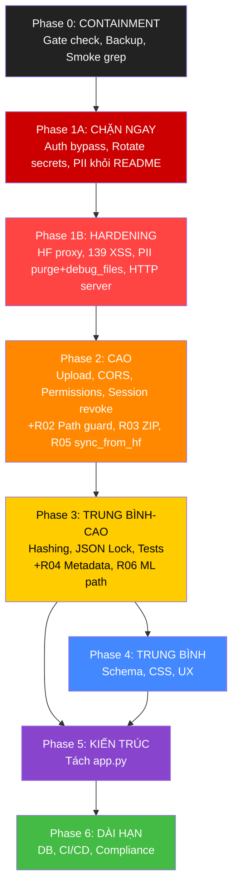

# Roadmap Sửa Chữa Code — Rehab-AI-Monitor

Tổng hợp từ [CODE_REVIEW_BUG_REPORT.md](file:///d:/AI20K/Rehab-AI-Monitor/docs/CODE_REVIEW_BUG_REPORT.md) (40 lỗi F01–F40, 20 phát hiện bổ sung N01–N20 đã thẩm định) và [DANH_GIA_DU_AN.md](file:///d:/AI20K/Rehab-AI-Monitor/docs/DANH_GIA_DU_AN.md).

> [!TIP]
> Roadmap này là tài liệu chiến lược. Kế hoạch triển khai chi tiết theo từng phase nằm tại [repair_plans/MAIN_PLAN.md](repair_plans/MAIN_PLAN.md), kèm [repair_plans/TEST_PLAN.md](repair_plans/TEST_PLAN.md) cho smoke/security/pytest/UI/CI gates.

> [!IMPORTANT]
> Dự án đang ở mức **Bảo mật: 2/10**, **Kiến trúc: 5/10**, **Bảo trì: 4/10**. Roadmap này ưu tiên sửa các lỗi có thể gây **lộ dữ liệu bệnh nhân** và **mất dữ liệu** trước, sau đó mới đến kiến trúc và UX.

> [!NOTE]
> Số liệu đo thực tế trên `app.py` (đo lại 17/06/2026 — section 10.3 bug report): **139** `unsafe_allow_html=True` · **104** bare `except:` · **136** `except Exception:` đúng mẫu · **225** mọi biến thể `except Exception...` · **12** `threading.Thread()` · **43** `save_data(...)` · **3** `doc_lock_save_data(...)` · **19,978 dòng** · **395 hàm**. Sau lớp thẩm định N01–N20 và rà soát bổ sung R01–R06, ưu tiên thực tế theo thứ tự: **N02/N07/N20/N01/N09 → N03/N05/N06/N11/N17 → R01/R02/R03/R05**.

---

## ⛔ Gate Bắt buộc — Xác nhận trước khi bắt đầu bất kỳ Phase nào

> [!CAUTION]
> **Câu hỏi sau phải được trả lời TRƯỚC KHI thực hiện bất kỳ task nào.** Câu trả lời quyết định mức độ xử lý toàn bộ roadmap.

**Repo/app này đã từng được push lên GitHub public hoặc deploy HF Spaces public chưa?**

| Trường hợp | Hành động bắt buộc ngay lập tức |
|------------|----------------------------------|
| ✅ Đã public | Rotate HF token ngay · Invalidate toàn bộ hash password cũ · Kiểm tra git history bằng BFG/git-filter-repo · Thông báo sự cố PII nếu cần |
| ❌ Chưa public | Tiếp tục Phase 0 bình thường |
| ❓ Không chắc | Coi như **đã public** và xử lý tương ứng |

> [!WARNING]
> Nếu đã public: không nên chỉ xóa file khỏi working tree — phải dùng `git filter-repo` hoặc BFG Repo Cleaner để xóa khỏi git history. Trước khi rewrite history, **bắt buộc**: backup cục bộ, thông báo cho team, rotate toàn bộ secrets trước, và kiểm tra kỹ cache/remote. Sau đó force-push và yêu cầu HF/GitHub purge cache. Đây là thao tác phá vỡ lịch sử commit nên cần quy trình thống nhất.

---

## Tổng quan các Phase

```mermaid
gantt
    title Roadmap Sửa Chữa Code
    dateFormat YYYY-MM-DD
    axisFormat %d/%m

    section Phase 0 - CONTAINMENT
    Gate check & smoke tests      :crit, p0, 2026-06-18, 1d

    section Phase 1A - CHẶN RÒ RỈ NGAY
    Auth bypass & secrets         :crit, p1a, after p0, 2d

    section Phase 1B - HARDENING
    Token proxy & XSS & PII       :crit, p1b, after p1a, 5d

    section Phase 2 - CAO
    Upload/CORS/Permissions       :high, p2a, after p1b, 5d
    Session revocation            :high, p2b, after p2a, 1d

    section Phase 3 - TRUNG BÌNH-CAO
    Hashing & JSON safety         :med, p3a, after p2b, 4d
    Exception handling & Tests    :med, p3b, after p3a, 4d

    section Phase 4 - TRUNG BÌNH
    Schema & CSS & Debug UI       :low, p4, after p3b, 5d

    section Phase 5 - KIẾN TRÚC
    Tách app.py modules           :arch, p5, after p4, 10d

    section Phase 6 - DÀI HẠN
    DB migration & CI/CD          :future, p6, after p5, 10d
```

---

## Phase 0 — Containment & Verification ⚫

> **Làm trong ngày đầu tiên, trước khi chạm vào code.** Mục tiêu: biết mình đang đứng ở đâu và có safety net tối thiểu.

### 0.1. Kiểm tra trạng thái public exposure

- [ ] Xác nhận câu hỏi Gate bắt buộc ở trên: repo/app đã từng public chưa?
- [ ] Nếu đã public → thực hiện toàn bộ hành động bắt buộc trong bảng Gate trước khi tiếp tục
- [ ] Kiểm tra git log, HF commit history, và Spaces access logs nếu có
- [ ] Tạo backup snapshot toàn bộ `database/*.json` trước khi sửa bất kỳ dữ liệu nào
- [ ] Freeze mọi link demo/share public cho tới khi xong Phase 1B

### 0.2. Smoke checks tối thiểu chạy ngay (không cần framework)

```powershell
# Kiểm tra auth bypass còn không (rg cho PowerShell/Windows)
rg "logged_in_user|logged_in_role" app.py scripts README.md docs -g "*.py" -g "*.md"

# Kiểm tra HF_TOKEN trong frontend output
rg "HF_TOKEN" app.py -g "*.py"

# Đếm unsafe_allow_html để có baseline
rg -c "unsafe_allow_html=True" app.py
```

- [ ] Chạy các lệnh rg trên, lưu kết quả làm baseline trước sửa
- [ ] Xác nhận `database/schedules.json` hiện là `[]` (không còn lỗi N18)
- [ ] Kiểm tra `.gitignore` hiện đang exclude hay include `database/*.json`

**Tiêu chí hoàn thành Phase 0:** Đã trả lời Gate question. Có backup database. Có baseline kết quả từ lệnh `rg`.

---

## Phase 1A — CHẶN RÒ RỈ NGAY (1–2 ngày) 🔴

> **Nhóm việc có thể làm trong vài giờ, không cần xây thứ mới.** Mục tiêu: đóng ngay những cửa đang mở toang.

### 1A.1. Xóa Auth Bypass qua Query Params

| | |
|---|---|
| **Mã lỗi** | F01, F22, N20 |
| **Mức độ** | Critical |
| **File** | [app.py](file:///d:/AI20K/Rehab-AI-Monitor/app.py) (~5376–5399, ~5441–5452), [README.md](file:///d:/AI20K/Rehab-AI-Monitor/README.md), [scripts/sync_data_and_report.py](file:///d:/AI20K/Rehab-AI-Monitor/scripts/sync_data_and_report.py) |

**Công việc:**
- [ ] Xóa hoàn toàn logic đọc `logged_in_user` / `logged_in_role` từ `st.query_params`
- [ ] Xóa logic ghi query params trong `_hoan_tat_dang_nhap()`
- [ ] Xóa mọi URL chứa `logged_in_user` trong README.md, scripts, docs
- [ ] **Sửa template trong `sync_data_and_report.py`** để không sinh lại link login bypass vào README (N20 — fix thủ công không bền nếu script còn giữ template cũ)
- [ ] Nếu cần deep-link, chỉ lưu `tab`/`page` trong query params, không lưu identity

**Tiêu chí hoàn thành:**
- Lệnh `rg "logged_in_user|logged_in_role" app.py scripts README.md` trả về 0 kết quả.
- Không còn URL/template chứa `?logged_in_user=` ở bất cứ đâu.
- Docs và báo cáo audit lịch sử có thể nhắc lại tên tham số, nhưng không chứa link bypass khả dụng.

---

### 1A.2. Rotate Secrets & Tắt Debug Token ngay

| | |
|---|---|
| **Mã lỗi** | F02, F05, F17, F39, N02, N08, N09 |
| **Mức độ** | Critical |
| **File** | [app.py](file:///d:/AI20K/Rehab-AI-Monitor/app.py) (~5100–5162, ~18712–18775), [database/users.json](file:///d:/AI20K/Rehab-AI-Monitor/database/users.json) |

**Công việc:**
- [ ] Rotate HF token (tạo token mới, revoke token cũ) — **bắt buộc nếu app từng public**
- [ ] Rotate toàn bộ mật khẩu mặc định đã bị lộ: `admin123@`, `bs123@`, `ncv123@`
- [ ] **Ngay lập tức:** Tắt debug popover hiển thị URL chứa token (comment out hoặc guard `if False`) — không cần xây proxy, chỉ cần ẩn nhanh
- [ ] Xóa fallback `HF_DATASET_ID` hard-code trong code, thay bằng kiểm tra env var và raise lỗi rõ ràng nếu thiếu
- [ ] Loại PII khỏi README.md và `scripts/sync_data_and_report.py` (tên thật, báo cáo lâm sàng, mapping bệnh nhân — N08, N09)
- [ ] **Chuyển báo cáo tự sinh sang `docs/generated/`** thay vì ghi vào README (giải quyết rủi ro PII trong commit)

**Tiêu chí hoàn thành:** HF token cũ đã revoke. Inspect tab DOM/Network hoặc test luồng render proxy không làm lộ `HF_TOKEN` ra frontend. README không còn PII/link bypass.

---

## Phase 1B — HARDENING (3–5 ngày) 🔴

> **Xây đúng chuẩn sau khi đã chặn rò rỉ ngay.** Đây là phần cần thời gian và cẩn thận hơn.

### 1B.1. Xóa Hard-coded Credentials & Xử lý Predefined Users

| | |
|---|---|
| **Mã lỗi** | F02, F21, N03 |
| **Mức độ** | Critical |
| **File** | [app.py](file:///d:/AI20K/Rehab-AI-Monitor/app.py) (~5100–5162), [database/users.json](file:///d:/AI20K/Rehab-AI-Monitor/database/users.json) |

**Công việc:**
- [ ] Xóa toàn bộ mật khẩu mặc định hard-code trong `_get_cached_users_dict()`
- [ ] Chuyển sang cơ chế seed-once: chỉ tạo predefined accounts khi database rỗng, không ghi đè
- [ ] Tách email NCV không dùng chung cho nhiều bệnh nhân (N03 — dùng chung email làm reset password yếu có thể takeover tài khoản bệnh nhân)
- [ ] Thêm flag `must_change_password` cho accounts mới seed

**Tiêu chí hoàn thành:** Không còn plaintext password trong source. `load_users()` không ghi đè user đã tồn tại.

---

### 1B.2. Xây Proxy HF Token & Hardening HTTP Video Server

| | |
|---|---|
| **Mã lỗi** | F05, F17, N01, N10, N15 |
| **Mức độ** | Critical |
| **File** | [app.py](file:///d:/AI20K/Rehab-AI-Monitor/app.py) (~1603–1689, ~1771–1796, ~3010–3022, ~19003–19008) |

**Công việc:**
- [ ] Tạo proxy endpoint server-side để phục vụ video từ HF (token chỉ dùng ở server)
- [ ] **HTTP video server (N01/N10):** Giới hạn `SimpleHTTPRequestHandler` chỉ phục vụ thư mục `media/` cụ thể, thêm `realpath` guard chặn path traversal/symlink, bỏ `Access-Control-Allow-Origin: *`, thêm token/session check
- [ ] Xóa debug popover hoàn toàn hoặc rebuild đúng cách (chỉ hiện khi `DEBUG=true` + role admin, mask token/path)

**Tiêu chí hoàn thành:** Inspect DOM/Network tab không thấy `HF_TOKEN`. HTTP server không phục vụ ngoài thư mục media.

---

### 1B.3. Khắc phục XSS/HTML Injection (139 chỗ)

| | |
|---|---|
| **Mã lỗi** | F06 |
| **Mức độ** | Critical |
| **File** | [app.py](file:///d:/AI20K/Rehab-AI-Monitor/app.py) — **139** chỗ `unsafe_allow_html=True` |

**Công việc:**
- [ ] Tạo helper `safe_html(value)` dùng `html.escape()` cho mọi field người dùng nhập
- [ ] Audit toàn bộ 139 vị trí `unsafe_allow_html=True`:
  - Dữ liệu nội bộ cố định → giữ nguyên
  - Dữ liệu user-generated (`comments`, `title`, `notes`, `exercise_name`, `plan`, tên BN) → escape
- [ ] Thay thế bằng `st.write`/`st.text`/`st.info` ở những chỗ không cần custom HTML
- [ ] Test inject `<script>alert(1)</script>` vào comments/tên để xác nhận đã chặn

**Tiêu chí hoàn thành:** Mọi dữ liệu user-generated đều được escape trước khi render HTML.

---

### 1B.4. Loại PII khỏi Repo & Bảo vệ gitignore (bao gồm debug_files)

| | |
|---|---|
| **Mã lỗi** | F40, N07, N08, **R01** |
| **Mức độ** | Critical |
| **File** | [database/](file:///d:/AI20K/Rehab-AI-Monitor/database/), [debug_files/](file:///d:/AI20K/Rehab-AI-Monitor/debug_files/), [.gitignore](file:///d:/AI20K/Rehab-AI-Monitor/.gitignore), [scripts/](file:///d:/AI20K/Rehab-AI-Monitor/scripts/) |

**Công việc:**
- [ ] Pseudonymize/xóa tên thật bệnh nhân trong `users.json` và toàn bộ `database/*.json`
- [ ] **R01 — Xóa/anonymize `debug_files/*.json`:** `debug_files/users.json`, `debug_files/doctor_evaluations.json`, `debug_files/video_list.json` chứa bản sao PII cũ — nếu chỉ xóa `database/` thì dữ liệu nhạy cảm vẫn còn
- [ ] Đưa `debug_files/*.json` vào `.gitignore`, chỉ giữ manifest hoặc dữ liệu mẫu đã sanitize
- [ ] Sửa `.gitignore` để exclude `database/*.json` runtime (trừ schema/seed files) — N07: hiện nhiều JSON nhạy cảm không bị gitignore
- [ ] Tạo `.push-guard` / pre-commit hook chặn commit chứa PII patterns (email, tên bệnh nhân, token)
- [ ] Nếu repo đã từng public: dùng BFG/git-filter-repo để xóa PII khỏi history (kể cả `debug_files/`)

**Tiêu chí hoàn thành:** Repo không chứa tên/email/triệu chứng thật trong cả `database/` lẫn `debug_files/`. `.gitignore` chặn JSON runtime. Pre-commit hook hoạt động.

---

## Phase 2 — ƯU TIÊN CAO: Stability & Access Control 🟠

> **Sửa trong sprint tiếp theo sau Phase 1B.** Ngăn mất dữ liệu và lỗi vận hành. Bao gồm các phát hiện mới R02, R03, R05 từ rà soát lần 3.

### 2.1. Giảm Upload Size & Validate File

| | |
|---|---|
| **Mã lỗi** | F08, F09, N05, N06 |
| **Mức độ** | High |
| **File** | [app.py](file:///d:/AI20K/Rehab-AI-Monitor/app.py) (~19464–19467, ~19516–19519), [.streamlit/config.toml](file:///d:/AI20K/Rehab-AI-Monitor/.streamlit/config.toml), [Dockerfile](file:///d:/AI20K/Rehab-AI-Monitor/Dockerfile) |

**Công việc:**
- [ ] Giảm `maxUploadSize` xuống 300 MB (config.toml + Dockerfile)
- [ ] Kiểm tra `file_upload.size` trước `getbuffer()`, reject sớm nếu quá lớn (N05 — hiện vẫn `getbuffer()` max 10 GB)
- [ ] Chạy `ffprobe` trước để validate: duration, resolution, codec, streams
- [ ] Reject file không phải video thật (magic bytes / MIME sniffing)
- [ ] Giới hạn ffmpeg `-threads 2` thay vì `-threads 0` (N06 — chiếm toàn bộ CPU trên môi trường ít vCPU)
- [ ] Thêm timeout cứng cho mọi `subprocess.Popen` ffmpeg không có timeout (`sync_transcode_to_h264()` đã có 1800s, cần tìm các nhánh Popen khác)

**Tiêu chí hoàn thành:** Upload >300MB bị reject. File không phải video bị reject trước khi vào pipeline.

---

### 2.2. Bật lại CORS/XSRF Protection

| | |
|---|---|
| **Mã lỗi** | F07 |
| **Mức độ** | High |
| **File** | [Dockerfile](file:///d:/AI20K/Rehab-AI-Monitor/Dockerfile) |

**Công việc:**
- [ ] Xóa `--server.enableCORS=false` và `--server.enableXsrfProtection=false` trong Dockerfile production
- [ ] Tạo tách config dev/prod: `.streamlit/config.toml` (prod) vs `.streamlit/config.dev.toml`
- [ ] Test app vẫn hoạt động sau khi bật lại XSRF

**Tiêu chí hoàn thành:** Production Dockerfile không tắt CORS/XSRF.

---

### 2.2b. Path Containment Guard cho Download/Sync/Resolve

| | |
|---|---|
| **Mã lỗi** | **R02** |
| **Mức độ** | High |
| **File** | [app.py](file:///d:/AI20K/Rehab-AI-Monitor/app.py) (~196–206, ~3353–3384, ~3615–3666, ~3669–3701, ~11616–11679) |

**Công việc:**
- [ ] Viết helper duy nhất `safe_data_path(rel_path, allowed_roots)` dùng `Path.resolve()` / `os.path.realpath()` để enforce containment trong `patient_uploads/`, `processed_results/`, nhóm JSON được phép
- [ ] Áp dụng cho tất cả: `get_clean_rel_path()`, `_hf_download_via_http()`, `_hf_download_dataset_file()`, `ensure_local_file()`, `download_file_with_progress()`
- [ ] Reject mọi path absolute, chứa `..`, hoặc nằm ngoài `DATA_DIR`
- [ ] Không xóa file cũ trong download helpers nếu path chưa qua containment guard

**Tiêu chí hoàn thành:** Mọi write/delete đi qua `safe_data_path()`. Reject path ngoài DATA_DIR và log cảnh báo.

---

### 2.2c. ZIP Frames Extract có Validate

| | |
|---|---|
| **Mã lỗi** | **R03** |
| **Mức độ** | High/Medium |
| **File** | [app.py](file:///d:/AI20K/Rehab-AI-Monitor/app.py) (~3715–3752) |

**Công việc:**
- [ ] Thay `zip_ref.extractall(frames_dir)` bằng giải nén từng entry thủ công
- [ ] Trước khi extract: duyệt `infolist()`, giới hạn tổng `file_size`, số entry, từng entry size
- [ ] Chỉ cho phép file ảnh với basename hợp lệ — không path separator, không absolute path, không `..`
- [ ] Resolve path đích và kiểm tra containment trước khi ghi từng file

**Tiêu chí hoàn thành:** ZIP extract không thể ghi file ngoài `frames_dir`. Zip bomb / file count explosion bị reject.

---

### 2.2d. `sync_from_hf.py` không ghi đè `users.json` mặc định

| | |
|---|---|
| **Mã lỗi** | **R05** |
| **Mức độ** | Medium/High |
| **File** | [scripts/sync_from_hf.py](file:///d:/AI20K/Rehab-AI-Monitor/scripts/sync_from_hf.py) (~27–36, ~181–189, ~260–269) |

**Công việc:**
- [ ] Loại `users.json` khỏi danh sách sync mặc định; yêu cầu flag rõ ràng `--include-users` để sync
- [ ] Với `users.json`, merge theo username — không ghi đè password/role nếu local mới hơn remote
- [ ] Thêm backup timestamped trước mỗi lần sync (không chỉ `.bak` một phiên bản)

**Tiêu chí hoàn thành:** Chạy `sync_from_hf.py` không ghi đè auth DB local mà không có flag rõ ràng.

---

### 2.3. Thêm Confirm Flow cho Destructive Actions

| | |
|---|---|
| **Mã lỗi** | F10, F11, F34 |
| **Mức độ** | High |
| **File** | [app.py](file:///d:/AI20K/Rehab-AI-Monitor/app.py) (~18252–18299, ~18521–18550), [scripts/reset_data.py](file:///d:/AI20K/Rehab-AI-Monitor/scripts/reset_data.py) |

**Công việc:**
- [ ] Thêm confirm dialog 2 bước cho: reset hệ thống, xóa lịch sử, xóa video, xóa lịch nhắc
- [ ] `delete_video_callback()`: dùng `.get()` thay `[]`, thêm kiểm tra role
- [ ] Filter xóa evaluation theo `(patient_username, video_name, exercise)` thay vì chỉ 2 field
- [ ] Backup JSON trước mọi thao tác xóa bulk
- [ ] `scripts/reset_data.py`: thêm `--yes`, `--dry-run`, backup timestamped
- [ ] Ghi audit log cho mọi destructive action

**Tiêu chí hoàn thành:** Mọi thao tác xóa/reset yêu cầu xác nhận 2 bước. Có backup trước khi xóa.

---

### 2.4. Tạo Permission Guard Tập trung

| | |
|---|---|
| **Mã lỗi** | F18, F11 |
| **Mức độ** | High |
| **File** | [app.py](file:///d:/AI20K/Rehab-AI-Monitor/app.py) — mọi callback mutate dữ liệu |

**Công việc:**
- [ ] Tạo helper `require_role(*allowed_roles)` kiểm tra `st.session_state` trước mọi mutation
- [ ] Định nghĩa permission matrix rõ ràng:

| Action | Bệnh nhân | Bác sĩ/KTV | NCV | Admin |
|--------|:---------:|:-----------:|:---:|:-----:|
| Upload video | ✅ | ❌ | ❌ | ✅ |
| Xem video mình | ✅ | ✅ | ✅ | ✅ |
| Đánh giá | ❌ | ✅ | ✅ | ✅ |
| Xóa video | ❌ | ❌ | ❌ | ✅ |
| Reset hệ thống | ❌ | ❌ | ❌ | ✅ |
| Xem PII bệnh nhân | Mình | Phụ trách | Pseudonymized | ✅ |

- [ ] Áp dụng `require_role()` vào tất cả callbacks: delete, reset, evaluate, upload
- [ ] Log actor/action/target/time/result

**Tiêu chí hoàn thành:** Mọi callback ghi/xóa dữ liệu đều tự kiểm tra role. Log audit đầy đủ.

---

### 2.5. Admin Session Revocation

> [!NOTE]
> Chuyển từ Phase 4 lên Phase 2 theo đề xuất reviewer — task này liên quan trực tiếp đến revoke phiên sau reset/sự cố bảo mật, không phải UX.

| | |
|---|---|
| **Mã lỗi** | F23 |
| **Mức độ** | High |
| **File** | [app.py](file:///d:/AI20K/Rehab-AI-Monitor/app.py) (~18252–18299) |

**Công việc:**
- [ ] Tạo `global_session_version` trong database
- [ ] Tăng version khi admin reset hệ thống hoặc sau sự cố bảo mật
- [ ] Mỗi request/rerun so version, mismatch → force logout toàn bộ client
- [ ] Liên kết với Permission Guard (2.4): rotate session sau mọi thao tác revoke quyền

**Tiêu chí hoàn thành:** Admin reset/revoke quyền sẽ force logout mọi phiên đang mở.

---

### 2.6. Sửa Password Reset Flow

| | |
|---|---|
| **Mã lỗi** | F03, N04 |
| **Mức độ** | High |
| **File** | [app.py](file:///d:/AI20K/Rehab-AI-Monitor/app.py) (~17890–17911) |

**Công việc:**
- [ ] Tạm tắt reset password trong app (chờ có email token thật)
- [ ] Hoặc: thêm reset token ngẫu nhiên, expiry 15 phút, hash token lưu DB
- [ ] Rate limit: max 5 lần/IP/giờ
- [ ] Sửa `_auth_lookup_key()` tránh collision casefold theo full_name (N04 — match mềm gây confusion khi đăng nhập/reset)
- [ ] Ghi audit log cho mọi attempt reset password

**Tiêu chí hoàn thành:** Reset password có token + expiry hoặc đã bị tắt. Auth lookup không còn collision casefold.

---

### 2.7. Sửa Google Login Flow

| | |
|---|---|
| **Mã lỗi** | F04 |
| **Mức độ** | Medium/High |
| **File** | [app.py](file:///d:/AI20K/Rehab-AI-Monitor/app.py) (~5461–5485) |

**Công việc:**
- [ ] Chỉ chấp nhận Google login sau callback OIDC hợp lệ
- [ ] Map email vào user record có sẵn, hoặc tạo record rõ ràng qua form đăng ký
- [ ] Thêm cấu hình allowlist domain nếu cần
- [ ] Không tự động set role `Bệnh nhân` cho mọi email Google
- [ ] Thêm rate limit/email verification cho đăng ký mới (N14)

**Tiêu chí hoàn thành:** Google login chỉ hoạt động cho email đã được map/đăng ký.

---

### 2.8. Xử lý Unsafe Pickle/Joblib Load

| | |
|---|---|
| **Mã lỗi** | F30 |
| **Mức độ** | High/Security |
| **File** | [utils/checkpoint_utils.py](file:///d:/AI20K/Rehab-AI-Monitor/utils/checkpoint_utils.py), [utils/pose_classifier_utils.py](file:///d:/AI20K/Rehab-AI-Monitor/utils/pose_classifier_utils.py) |

**Công việc:**
- [ ] Thêm hash/checksum verification trước khi load pickle/joblib
- [ ] Checkpoint: ưu tiên chuyển sang JSON/npz cho dữ liệu thuần
- [ ] Model: verify hash của file model trước khi `joblib.load()`
- [ ] Không load pickle từ thư mục user upload hoặc cloud sync chưa verify

**Tiêu chí hoàn thành:** Mọi `pickle.load`/`joblib.load` có checksum verification.

---

### 2.9. Sửa Login UX

| | |
|---|---|
| **Mã lỗi** | F19 |
| **Mức độ** | Medium |
| **File** | [app.py](file:///d:/AI20K/Rehab-AI-Monitor/app.py) (~17890–17911) |

**Công việc:**
- [ ] Bỏ bước chọn role trước khi login
- [ ] Xác thực username/password trước, tự điều hướng theo role trong database
- [ ] Thông báo lỗi login không tiết lộ role của tài khoản (tránh role enumeration)

**Tiêu chí hoàn thành:** Login flow: nhập username + password → app tự chọn role → redirect.

---

## Phase 3 — TRUNG BÌNH-CAO: Data Integrity & Quality 🟡

> **Nền tảng cho refactor lớn sau này.** Tăng độ tin cậy dữ liệu và khả năng debug. Bao gồm phát hiện mới R04, R06 từ rà soát lần 3.

### 3.1. Đổi Password Hashing sang Argon2/Bcrypt

| | |
|---|---|
| **Mã lỗi** | F20 |
| **Mức độ** | High |
| **File** | [app.py](file:///d:/AI20K/Rehab-AI-Monitor/app.py) (~5025–5029), [requirements.txt](file:///d:/AI20K/Rehab-AI-Monitor/requirements.txt) |

**Công việc:**
- [ ] Thêm `argon2-cffi` vào requirements.txt
- [ ] Viết `hash_password_v2()` dùng argon2
- [ ] Migration: khi user login thành công với SHA-256 hash cũ → re-hash bằng argon2 và lưu lại
- [ ] Đánh dấu `hash_version` trong user record để biết hash nào cần migrate

**Tiêu chí hoàn thành:** Tất cả password mới dùng argon2. Hash cũ được migrate dần khi login.

---

### 3.2. Chuẩn hóa JSON Read/Write với Lock

| | |
|---|---|
| **Mã lỗi** | F12, N11 |
| **Mức độ** | Medium/High |
| **File** | [app.py](file:///d:/AI20K/Rehab-AI-Monitor/app.py) — mọi `load_data()`/`save_data()` (**43** lần `save_data`, chỉ **3** lần `doc_lock_save_data`) |

**Công việc:**
- [ ] Tạo `storage/json_store.py` với helper `read_json()`, `write_json()` có file lock
- [ ] Mọi ghi JSON đi qua helper này — đặc biệt `VIDEOS_FILE`/`EVALUATIONS_FILE` (N11 — nhiều chỗ không qua lock, nguy cơ lost update)
- [ ] Thêm `version`/`updated_at` cho mỗi record
- [ ] Merge theo key thay vì overwrite toàn bộ file
- [ ] Loại bỏ `doc_lock_save_data()` rải rác, thống nhất qua helper mới
- [ ] Kiểm soát background sync HF: đảm bảo không ghi đè JSON local trong lúc UI đang ghi

**Tiêu chí hoàn thành:** Mọi ghi JSON đi qua 1 helper duy nhất có lock. Không còn pattern load→mutate→save rải rác.

---

### 3.3. Giảm Exception Nuốt Lỗi

| | |
|---|---|
| **Mã lỗi** | F26, N17 |
| **Mức độ** | High/Maintainability |
| **File** | [app.py](file:///d:/AI20K/Rehab-AI-Monitor/app.py) — **104** bare `except:` + **136** `except Exception:` đúng mẫu (**225** mọi biến thể) |

**Công việc:**
- [ ] **Ưu tiên:** Sửa `except:` / `except Exception: pass` ở các thao tác IO quan trọng (ghi/xóa file, save JSON, sync HF)
- [ ] Thay bằng exception cụ thể: `FileNotFoundError`, `JSONDecodeError`, `PermissionError`, `requests.RequestException`
- [ ] Thêm structured logging: `logger.error(f"actor={actor} action={action} file={file}", exc_info=True)`
- [ ] Không dùng `pass` trong nhánh lỗi ghi/xóa dữ liệu

**Tiêu chí hoàn thành:** Giảm bare `except:` xuống <10. Mọi IO error được log có context.

---

### 3.3b. Sửa Metadata frames_zip_path & Thêm Validator

| | |
|---|---|
| **Mã lỗi** | **R04** |
| **Mức độ** | Low/Medium _(đã giảm — `database/video_list.json` đã sửa đúng, chỉ còn `debug_files/` sai)_ |
| **File** | [debug_files/video_list.json](file:///d:/AI20K/Rehab-AI-Monitor/debug_files/video_list.json), [app.py](file:///d:/AI20K/Rehab-AI-Monitor/app.py) (~2202–2216) |

> [!NOTE]
> Quét lại 17/06/2026: `database/video_list.json` bản ghi đầu tiên đã có `frames_zip_path` đúng. Lỗi chỉ còn trong `debug_files/video_list.json` (bản sao cũ). Mức nghiêm trọng giảm xuống Low/Medium.

**Công việc:**
- [x] ~~Sửa dữ liệu hiện tại: bản ghi đầu tiên `database/video_list.json`~~ _(đã đúng trong working tree)_
- [ ] Xóa hoặc sửa bản sao sai trong `debug_files/video_list.json` _(sẽ được xử lý cùng R01 ở Phase 1B.4)_
- [ ] Trong `_frames_zip_path_from_video()`: nếu timestamp trong `frames_zip_path` khác timestamp trong `processed_path`, ưu tiên path suy ra từ `processed_path` và log cảnh báo
- [ ] Thêm script validation metadata cho toàn bộ `video_list.json` (timestamp consistency check)

**Tiêu chí hoàn thành:** Không còn bản ghi video có `frames_zip_path` trỏ sai timestamp. Validation script chạy được.

---

### 3.3c. Siết Path Resolution trong ML Reprocess

| | |
|---|---|
| **Mã lỗi** | **R06** |
| **Mức độ** | Medium |
| **File** | [utils/pose_classifier_utils.py](file:///d:/AI20K/Rehab-AI-Monitor/utils/pose_classifier_utils.py) (~646–672, ~855–947) |

**Công việc:**
- [ ] Giới hạn `resolve_local_path()` vào `data_dir`, `processed_dir`, `db_dir` sau khi resolve realpath
- [ ] Thêm `--dry-run` cho pipeline `reprocess_videos_with_classifier()` — log danh sách file sẽ ghi trước khi thực thi
- [ ] Không cho phép path ngoài workspace trong bất kỳ candidate nào của resolver

**Tiêu chí hoàn thành:** ML reprocess không thể ghi/đọc file ngoài workspace. `--dry-run` hoạt động.

---

### 3.4. Thêm Test Suite Cơ bản

| | |
|---|---|
| **Mã lỗi** | F31 |
| **Mức độ** | High/Maintainability |
| **File** | Tạo mới `tests/` |

> [!NOTE]
> Phase 0 đã có smoke checks bằng grep — không cần framework. Phase 3 xây test suite proper phục vụ CI và safety net cho Phase 5 refactor.

**Công việc:**
- [ ] Tạo `tests/test_auth.py`: không login được bằng query params, role guard hoạt động
- [ ] Tạo `tests/test_storage.py`: load/save JSON không mất update, lock hoạt động
- [ ] Tạo `tests/test_schema.py`: validate schema users/videos/evaluations/schedules
- [ ] Tạo `tests/test_video.py`: path sanitize, file type validation
- [ ] Tạo `tests/test_password.py`: argon2 hash/verify, migration SHA-256 → argon2
- [ ] Setup pytest config, thêm vào CI

**Tiêu chí hoàn thành:** `pytest tests/` pass. Có coverage cho auth, storage, schema, video path.

---

### 3.5. Pin Dependencies

| | |
|---|---|
| **Mã lỗi** | F32 |
| **Mức độ** | Medium |
| **File** | [requirements.txt](file:///d:/AI20K/Rehab-AI-Monitor/requirements.txt) |

**Công việc:**
- [ ] Pin version cho tất cả packages (pandas, plotly, Pillow, pydub, scikit-learn, joblib, opencv, streamlit-webrtc, aiortc, av...)
- [ ] Tách `requirements-dev.txt` (pytest, linting) và `requirements-prod.txt`
- [ ] Xóa runtime `pip install` trong scripts (F29), đưa vào requirements

**Tiêu chí hoàn thành:** `pip install -r requirements.txt` reproducible. Không còn runtime pip install.

---

### 3.6. Sanitize Filename Upload

| | |
|---|---|
| **Mã lỗi** | F25 |
| **Mức độ** | Medium |
| **File** | [app.py](file:///d:/AI20K/Rehab-AI-Monitor/app.py) (~19280–19286) |

**Công việc:**
- [ ] Tạo helper `sanitize_filename()`: whitelist `[a-zA-Z0-9._-]`, normalize unicode, giới hạn 200 chars
- [ ] Lưu original filename trong metadata JSON
- [ ] Áp dụng cho mọi file upload path

**Tiêu chí hoàn thành:** Filename chỉ chứa safe characters. Original name lưu trong metadata.

---

### 3.7. Sửa Script Destructive & Runtime Pip

| | |
|---|---|
| **Mã lỗi** | F29, F33, F34 |
| **Mức độ** | Medium |
| **File** | [scripts/](file:///d:/AI20K/Rehab-AI-Monitor/scripts/), [utils/pose_classfier_untils.py](file:///d:/AI20K/Rehab-AI-Monitor/utils/pose_classfier_untils.py) |

> [!NOTE]
> `scripts/sync_data_and_report.py` có `SyntaxWarning` về escape `\|` (phát hiện quét 17/06/2026). Chưa phải blocker runtime nhưng nên sửa cùng đợt cleanup script.

**Công việc:**
- [ ] `scripts/reset_data.py`: thêm `--yes`, `--dry-run`, backup trước xóa
- [ ] `scripts/sync_data_and_report.py`, `scripts/extract_youtube_reference.py`: xóa runtime `pip install`, báo lỗi thiếu dep
- [ ] Deprecate `utils/pose_classfier_untils.py` (typo), redirect import nếu cần

**Tiêu chí hoàn thành:** Script không tự cài package. Reset script có dry-run.

---

## Phase 4 — TRUNG BÌNH: Frontend & UX Improvement 🔵

> **Cải thiện UX và giảm tech debt frontend.**

### 4.1. Schema Validation cho JSON

| | |
|---|---|
| **Mã lỗi** | F13, F14 |
| **File** | [app.py](file:///d:/AI20K/Rehab-AI-Monitor/app.py), [database/](file:///d:/AI20K/Rehab-AI-Monitor/database/) |

**Công việc:**
- [ ] Tạo `models/schemas.py` với dataclass/Pydantic cho: User, Video, Evaluation, Schedule, PatientSymptom
- [ ] Validate schema khi load JSON, auto-fill defaults cho missing fields
- [ ] Viết migration script cho existing data
- [ ] Đổi mọi `dict['key']` sang `.get('key', default)` cho fields không đảm bảo
- [ ] _Ghi chú:_ `database/schedules.json` hiện đã là `[]` (N18 đã lỗi thời), F13 vẫn đáng giữ để đảm bảo schema nhất quán

---

### 4.2. Tách CSS ra File Riêng

| | |
|---|---|
| **Mã lỗi** | F15, F35 |
| **File** | [app.py](file:///d:/AI20K/Rehab-AI-Monitor/app.py) (~5392–6216, ~6276–7158, ~13949–14205) |

**Công việc:**
- [ ] Chuyển CSS từ Python string sang `assets/styles.css`, `assets/theme_dark.css`, `assets/theme_light.css`
- [ ] Dùng `st.markdown(open("assets/styles.css").read(), ...)` hoặc Streamlit theme API
- [ ] Giảm `!important`, scope selector theo class cụ thể (tránh `*`, `div`, `span` global)
- [ ] Tạo variant riêng cho destructive buttons (đỏ, khác visual hierarchy)
- [ ] Thay hover zoom `scale(2.2)` bằng modal/lightbox

---

### 4.3. Loại bỏ JS DOM Hacks

| | |
|---|---|
| **Mã lỗi** | F16 |
| **File** | [app.py](file:///d:/AI20K/Rehab-AI-Monitor/app.py) (~5339–5387, ~18863–18888) |

**Công việc:**
- [ ] Thay JS click tab → `st.session_state` navigation
- [ ] Thay JS clock → Streamlit component hoặc server-side time
- [ ] Cô lập JS cần thiết vào custom component riêng

---

### 4.4. Phân quyền Bác sĩ–Bệnh nhân

| | |
|---|---|
| **Mã lỗi** | F24, N12, N19 |
| **File** | [app.py](file:///d:/AI20K/Rehab-AI-Monitor/app.py) |

**Công việc:**
- [ ] Thêm assignment doctor↔patient trong user record
- [ ] Bác sĩ chỉ xem bệnh nhân mình phụ trách
- [ ] NCV xem dữ liệu pseudonymized
- [ ] Kiểm soát gTTS gọi Google API trong runtime — ghi chú cho báo cáo privacy (N12)
- [ ] Review WebRTC STUN policy, thêm consent/session limit nếu cần (N19)

---

### 4.5. Cleanup Data Sync Script

| | |
|---|---|
| **Mã lỗi** | F38 |
| **File** | [scripts/sync_data_and_report.py](file:///d:/AI20K/Rehab-AI-Monitor/scripts/sync_data_and_report.py) |

> [!NOTE]
> Phần PII/README đã xử lý ở Phase 1A.2. Phase 4 chỉ giữ phần cải thiện cấu trúc script.

**Công việc:**
- [ ] Chỉ dùng 1 data directory, bỏ copy JSON ra root
- [ ] README chỉ tóm tắt và link tới `docs/generated/` (đã tạo ở Phase 1A.2)

---

### 4.6. Đặt tên hàm/thread rõ ràng

| | |
|---|---|
| **Mã lỗi** | F28 |
| **File** | [app.py](file:///d:/AI20K/Rehab-AI-Monitor/app.py) |

**Công việc:**
- [ ] Rename `_worker` → `_hf_upload_worker`, `_media_prefetch_worker`
- [ ] Rename `_frag` → `_job_status_fragment`, etc.
- [ ] Tránh callback lồng nhau cùng tên

---

## Phase 5 — KIẾN TRÚC: Tách Monolith `app.py` 🟣

> **Refactor lớn nhất.** Yêu cầu test suite từ Phase 3 làm safety net. App.py hiện ~20K dòng, 395 hàm, 5 class, 12 background threads.

| | |
|---|---|
| **Mã lỗi** | F27, F36 |
| **Mức độ** | High/Maintainability |

### 5.1. Tách Module Auth

**Tạo mới:** `auth.py`
- Login, password hashing, session management, role guards, `require_role()`
- Tách khỏi UI render

### 5.2. Tách Module Storage

**Tạo mới:** `storage/json_store.py`
- Load/save JSON, schema validation, locking, migration
- Thay thế mọi `load_data()`/`save_data()` rải rác

### 5.3. Tách Module Cloud/HF Sync

**Tạo mới:** `cloud/hf_sync.py`
- HF download/upload, token handling, retry/backoff
- Không expose token ra bên ngoài module

### 5.4. Tách Module Video

**Tạo mới:** `video/io.py`
- Upload, path sanitize, ffprobe, transcode, video serving
- Tách khỏi UI render

### 5.5. Tách UI theo Role/Tab

**Tạo mới:** `ui/patient.py`, `ui/doctor.py`, `ui/researcher.py`, `ui/admin.py`, `ui/styles.py`
- Mỗi file chỉ chứa render logic cho 1 role/tab
- `app.py` chỉ là orchestrator: import modules, route theo role

> [!WARNING]
> Phase 5 nên làm theo từng lát nhỏ (slice-by-slice), mỗi lát có test bảo vệ. **KHÔNG** refactor toàn bộ app.py cùng lúc.

### 5.6. Tách Side Effects khỏi Boot Sequence

- Di chuyển các hàm khởi tạo hệ thống, side effects ở top-level (như chạy thread transcode nền khi import) vào function `app_startup()` có kiểm soát.
- Đảm bảo việc import file không tự sinh side-effect, tách pure functions khỏi Streamlit rendering.

---

## Phase 6 — DÀI HẠN: Production-Ready 🟢

> **Chuẩn bị cho triển khai thật.** Cần đánh giá lại sau Phase 5.

### 6.1. Chuyển Database sang SQLite/Postgres

- Thay JSON flat-file bằng database có transaction, schema, migration
- Dùng Alembic hoặc tương đương cho migration
- Backup tự động

### 6.2. CI/CD Pipeline

- GitHub Actions: lint, test, build Docker, deploy staging
- Pre-commit hooks: chặn PII, token, password trong code
- Security scanning (bandit, safety)
- Smoke tests Playwright/Streamlit cho 4 role chính

### 6.3. Chuẩn hóa Background Job System

| | |
|---|---|
| **Mã lỗi** | F27, F37, N16 |

- Thay 12 thread ad hoc bằng job queue (Celery/RQ/simple queue)
- Registry/status cho mọi background job
- Graceful shutdown, backoff, health check
- Kiểm soát thread `while True` không có stop event/backoff đầy đủ (N16)

### 6.4. Privacy & Compliance

- Data classification policy
- Consent management cho bệnh nhân
- Audit trail đầy đủ
- Pseudonymization pipeline cho research data export
- Xác minh và dọn git history nếu repo từng được push public

---

## Dependency Map



---

## Ước lượng Effort

| Phase | Số task | Effort ước lượng | Yêu cầu trước |
|-------|:-------:|:----------------:|:--------------:|
| Phase 0 | 2 | 0.5–1 ngày | Gate question |
| Phase 1A | 2 | 1–2 ngày | Phase 0 |
| Phase 1B | 4+1 (R01) | 3–5 ngày | Phase 1A |
| Phase 2 | 9+3 (R02/R03/R05) | 7–10 ngày | Phase 1B |
| Phase 3 | 7+2 (R04/R06) | 7–9 ngày | Phase 2 |
| Phase 4 | 6 | 4–6 ngày | Phase 3 |
| Phase 5 | 5 | 8–12 ngày | Phase 3 + 4 (test suite) |
| Phase 6 | 4 | 10–15 ngày | Phase 5 |
| **Tổng** | **45** | **41–60 ngày** | |

> [!NOTE]
> Rà soát lần 3 bổ sung 6 lỗi R01–R06: R01 vào Phase 1B (debug_files PII), R02/R03/R05 vào Phase 2 (path containment, ZIP extract, sync_from_hf), R04/R06 vào Phase 3 (metadata validation, ML path guard). Tổng tăng từ 39 lên 45 task, effort tăng nhẹ ~3–4 ngày.

> [!IMPORTANT]
> **Cập nhật đồng bộ 17/06/2026:** Roadmap đã được đối chiếu lại với section 10 của [CODE_REVIEW_BUG_REPORT.md](file:///d:/AI20K/Rehab-AI-Monitor/docs/CODE_REVIEW_BUG_REPORT.md). Các thay đổi chính: sửa số liệu metric (bare except: 104, except Exception: 136/225), cập nhật line references theo quét lại app.py, giảm mức R04 xuống Low/Medium (database/video_list.json đã sửa), thêm save_data stats (43 lần, chỉ 3 qua lock).
